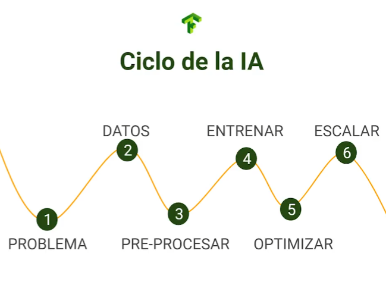
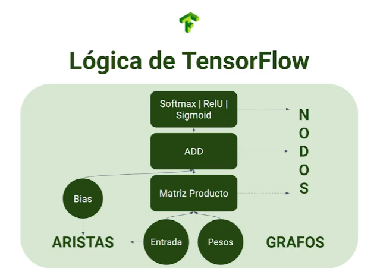
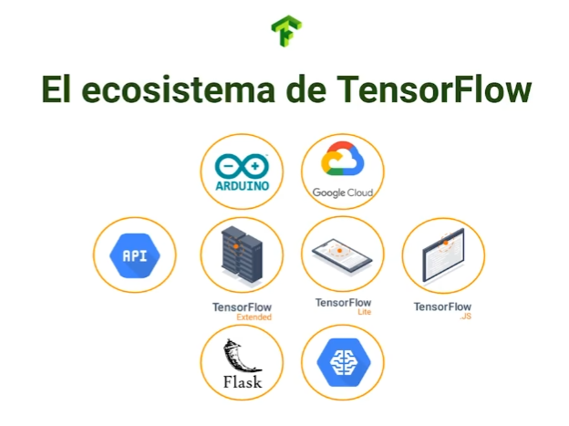

# Curso Profesional de Redes Neuronales con TensorFlow

## Redes neuronales con TensorFlow

Por qué debes tomar el curso

- Quieres aprender cómo aplicar inteligencia artificial a imágenes.

- Tienes las bases pero quieres volverte un pro configurando redes neuronales.

- Quieres crear tu propio tu propio modelo.

El uso de una IA parte desde un problema no se puede crear un modelo tan complejo como redes neuronales solo porque si, terminaríamos  sin resolver nada.



### Que Haremos?

- llevar redes neuronales a la practica

- Cargar bases de datos

- Optimizar modelos

- Como evitar el overfitting y el underfitting?

- Transferencia de aprendizaje usando modelos pre-entrenados

- Almacenar y cargar modelos

### Proyecto del curso

vamos a crear un modelo capaz de generar y detectar letras de lenguaje de señas.

vamos a omitir la J y la Z porque se generan con un movimiento.

usando una base de datos de kaggle.

### Proyectos opcionales

Deteccion de tumores, deteccion de Tom y Jerry, deteccion de Malaria

Lenguaje de Señas:
https://storage.googleapis.com/platzi-tf2/sign-language-img.zip

Tom & Jerry:
https://storage.googleapis.com/platzi-tf2/TomAndJerry.zip

Tumor:
https://storage.googleapis.com/platzi-tf2/TumorClassification.zip

Malaria:
https://storage.googleapis.com/platzi-tf2/MalariaCells.zip

Notebook Malaria:
https://colab.research.google.com/drive/10TQClWantn0elEU_SHc8IuTyheRIgGVD?usp=sharing

Notebook TomAndJerry:
https://colab.research.google.com/drive/1ogv1lNKvltcbVe9XyPK_cb9VO4fp0E8Y?usp=sharing

Notebook Tumor:
https://colab.research.google.com/drive/1Ksv1KdAkx4DK4Ao090vF3ihw-q5Klg7z?usp=sharing

**Descargar las bases de los ejercicios**:

```bash
# Lenguaje de Señas
wget --no-check-certificate https://storage.googleapis.com/platzi-tf2/sign-language-img.zip -O sign-language-img.zip

# Tom & Jerry
wget --no-check-certificate https://storage.googleapis.com/platzi-tf2/TomAndJerry.zip -O TomAndJerry.zip

# Tumores
wget --no-check-certificate https://storage.googleapis.com/platzi-tf2/TumorClassification.zip -O TumorClassification.zip

# Celulas de Malaria
wget --no-check-certificate https://storage.googleapis.com/platzi-tf2/MalariaCells.zip -O MalariaCells.zip
```

### Qué aprenderás?

- Cómo cargar tus propias bases de datos.
- Cargar bases de datos en formatos como CSV, JSON, BASE64, imágenes.

- Aplicar técnicas para optimizar tus modelos.

- agregar métricas en el entrenamiento de tus modelos.

- a cargar y guardar modelos

- Autotunner de Keras para encontrar mejores variables

- Bases de aprendizaje por transferencia

- Uso de TensorBoard y como mostrar tu proyecto al mundo entero

- A tener tu modelo listo para utilizarlo como inferencia.

## Introducción a TensorFlow 2.0

Existen 5 principales frameworks (o librerías) de deep learning:

1. Tensorflow // El que se usará en el curso

2. Caffe 

3. Pytorch

4. Microsoft CNTK

5. Gluon

Se puede utilizar Tensorflow con Python, Javascript y C++
este curso se enfocara en Python

De tensorflow 1 a 2 hubo un cambio enorme
Usando Eager Execution



Tensowflow funciona en combinacion con Keras

https://www.youtube.com/watch?v=PUAdj3w3wO4&ab_channel=LexFridman

Tensorflow 2.0 tiene un gran ecosistema donde puedes desplegar tus modelos



https://www.tensorflow.org/api_docs

https://www.meetup.com/es/Tensorflow-Colombia/?_cookie-check=bU7JEs4Z9F-W14Yy

